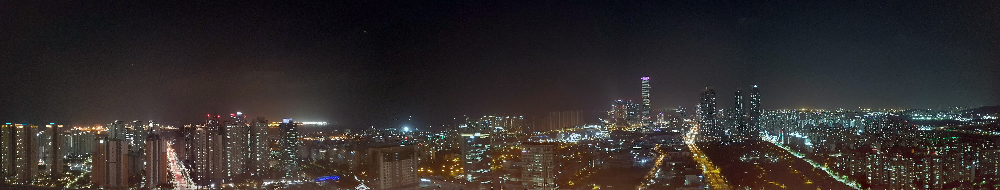
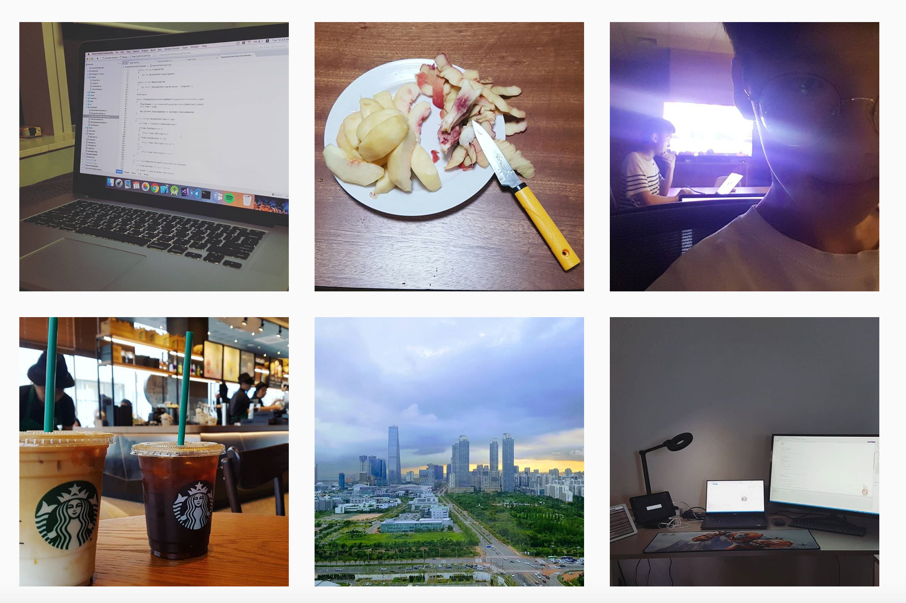

# 태어나다
저는 충청남도 금산의 한 집에서 막내로 태어났습니다. 저의 가정은 아버지, 어머니, 큰 누나, 작은 누나 그리고 저 이렇게 5명으로 이루어져 있고 아버지는 토목업에, 어머니는 코웨이 코디로 종사하시고 누나 둘은 아직 대학생입니다. 어쩌다보니 5살, 3살 많은 누나들보다도 앞서 직장을 얻게 되었네요.

저는 딸이 둘 있는 집안에 남자 막내로 태어나다 보니 아버지의 사랑을 많이 받으며 살아왔습니다. 아버지와 매주 함께 단 둘이서 목욕탕을 가고, 항상 먹을 것, 입을 것 신경 써주시며 사주시다 보니 초등학생 때 누나가 아버지가 편애한다고 말했던 것이 생각나네요. 그 만큼 사랑을 많이 받으며 컸습니다.

아버지가 토목업에 종사하시다 보니 4,5년에 한 번씩 공사현장이 바뀌십니다. 그러다보니 저희 집은 다른 집에 비해 많이 이사다니는 편이었습니다. 저희 집이 총 살았던 도시는 수원, 무안, 금산, 부여, 대전 총 5곳 입니다. 큰 누나와 작은 누나는 각각 수원과 무안에서 태어났고 저는 금산에서 태어났습니다. 

사실 저의 고향은 금산이긴 하지만 유치원을 다닌 곳은 부여, 그리고 초등학교 2학년부터 살게 된 대전에서 10년을 넘게 살아 사실 마음의 고향은 대전이고 금산과 부여는 제 유년의 기억이 담긴 추억의 도시들입니다.

# 과학에 빠지다
초등학교에 입학 한 후, 친구들과 잘 어울리며 놀았고 공부도 어느 정도 하는 편이었습니다. 반에서 4~5등은 항상 유지했었습니다. 초등학교 저학년 시절에는 별 관측 등 우주 관련 행사를 많이 방문하다 보니 별에 대한 흥미가 있었고 그래서 저의 첫번째 꿈은 **천문학자**가 되는 것이었습니다. 

그러다 사촌형이 준 아인슈타인이라는 만화책을 보게 되었습니다. 아인슈타인의 일생을 만화로 풀이한 책인데 읽다 상대성 이론에 대해 알게 되었습니다. 당시 상대성 이론을 정확히 이해하지 못했지만,

> "빛에 가까운 속도로 우주를 30년 여행하면 지구에서는 50년이 흐른다."  

라는 말에 엄청난 충격을 받고 그때 '나도 아인슈타인과 같은 **물리학자**가 되어야겠다.'라고 생각하게 되고 그때부터 과학에 대해 푹 빠지게 되었습니다.

수업 과목 중 가장 좋아하는 과목이 과학이었고 과학 수업시간에 과학 실험을 하는 것이 너무 좋고 재미었습니다. 학교에서 수학 과학 영재도 해보고 방학에는 항상 과학 캠프에 참가했을 정도니까요.

# 컴퓨터와 친해지다

저희 집은 좋은 컴퓨터를 사용하지는 않고 조금 사양이 좋지 않은 컴퓨터를 사용했습니다. 그러다보니 컴퓨터가 잘 고장나게 되고 컴퓨터 수리기사님이 저희 집을 방문하여 컴퓨터를 수리하는 일이 종종 있었습니다.

저는 수리기사님이 오실 때마다 호기심에 항상 어떻게 고치는 건지 수리기사님 옆에서 지켜보았습니다. 서당 개도 3년이면 풍월을 읊는다고 수리기사님 옆에서 지켜보던 것이 컴퓨터에 대한 기본 지식을 쌓게 해준 것 같습니다. 

집에서 가장 컴퓨터를 잘 다루다보니 컴퓨터에 대한 흥미가 생기는 것은 당연했습니다. 이때부터 종종 컴퓨터 프로그램을 어떻게 만들까 라고 생각하기 시작한 것 같습니다.

# 프로그래밍과 만나다
중학교에 입학하고 나서도 공부는 초등학교 때 그대로 반에서 4등 정도는 했습니다. 새로 많은 친구들도 만나 친하지기도 했습니다.

정확한 날짜는 기억나지 않지만 중학교 1학년 때였을 것입니다. 어머니와 함께 서점에 갔습니다. 서점을 둘러보던 중 우연히 컴퓨터 관련 서적을 판매하는 코너에 가게 되었습니다. 그 곳에서 C언어 책을 정말 우연히 보게 되었습니다. C언어를 배우면 컴퓨터 프로그램을 만들 수 있다는 설명에 저는 그 때 500쪽이 넘는 C 프로그래밍 책을 구매했습니다.

  
*(바로 이 책입니다. 방금 검색해보니 684쪽이네요.)*

집에 와서 매일 시간날 때마다 책을 한글자 한글자 읽었습니다. 이제와서 생각하면 전공책을 어떻게 한글자 한글자 읽었나 싶기도 합니다만 그때 당시에는 정말 한글자 한글자 다 읽으며 이해되지 않으면 다시 읽었습니다.

그러다보니 2학년 때에 if, switch 정도 할 정도였고 3학년 때에는 for, while 까지 하는 정도에 머물었습니다.

하지만 책의 있는 문제를 풀며 콘솔창에 하얀 글씨를 띄울 때마다 정말 어떻게 이렇게 재미있을까 하며 프로그래밍을 배웠습니다.

그렇지만 마음 한편에는 

> 'C언어로는 검정화면에 하얀 글씨밖에 못 띄우는 데,  
> 정말 C언어 다 배우면 곰플레이어같은 컴퓨터 프로그램을 만들 수 있는 걸까?'

라는 생각이 자리 잡기도 했습니다.

# 대마고를 알게 되다
저는 중학교 당시만 해도 공부를 어느 정도 하는 편이기에 고등학교에서 열심히 공부해 좋은 대학의 컴퓨터공학과를 가자는 생각이었습니다.
 
어느날 저희 학교가 신설된다는 이야기를 듣긴 했지만 처음에는 크게 관심도 없었습니다. 당시 저희 학교가 대전전에 있는 고등학교 중 뒤에서 1, 2등을 다투는 최고의 꼴통 학교이기도 했고 고등학교에 가서 열심히 공부해 좋은 대학을 가는 것이 더 좋을 것 같다는 생각이었습니다. 

그러던 중, 저희 학교 원서 접수일이 한 달 정도 남은 날, 저와 같은 고등학교를 생각하던 제 친구가 저에게 이렇게 말했습니다.

> "만약 내가 너라면 이 학교에 지원했을거야."

저는 그 순간 저희 학교에 대해서 색안경을 끼고 바라보고 있었던 것을 알게 되었습니다. 그리고 그 색안경을 벗고 저희 학교에 가는 것에 대해 진지하게 고민하기 시작했습니다.

> '과연 고등학교에 가서 좋은 대학을 갈 수 있을까?'  

> '좋은 대학을 간다고 해서 좋은 회사에 갈 수 있을까?'

많고 많은 고민을 했습니다. 미래에 대한 불확실성에서 저는 오히려 저희 학교로 가는 길이 **빛이 보이는 것을 느꼈습니다.** 결국 저는 저희 학교에 지원하겠다는 결정을 원서 접수가 한 달도 남지 않은 때에 하게 됩니다. 

그리고 저는 저희 학교의 입학 설명회을 한 번도 듣지 않은 채로 저희 학교에 입학하게 됩니다.

우리 학교에 입학할 때, 많은 분들이 우려하셨습니다. 담임 선생님을 비롯한 많은 선생님들은

> '공부도 잘하는데 왜 그런 학교에 가냐'  
> '다시 한 번 생각해봐라'  
> '대학은 가야할 것 아니냐'  

등 많은 걱정을 표출하셨고 어머니는 저의 의견에 동의해주셨지만 아버지도 다시 한 번 생각해보라고 하실 정도 마이스터고라는 불확실성에 대해서 많이 걱정하셨습니다. 저는 아버지에게 저의 생각을 담은 장문의 문자를 작성하여 보냈고 아버지는 문자를 읽으시고 '우리 아들 다 컸다'며 응원해주셨습니다.

# C#에 빠지다
위에서 말했듯이 C언어를 공부할 당시에는 저는 이거 가지고 정말 컴퓨터 프로그램을 만들 수 있을까 라는 생각을 하고 있었습니다.

그리고 그 생각은 고등학교 입학하고도 1학기간 계속 되었습니다. 계속 C언어 공부만 했기 때문이죠. 그러던 중 1학기가 끝나고 방학 방과후 시간에 C# 수업을 듣게 됩니다.

C#을 처음 배울때에는 C언어랑 크게 차이가 없다고 느껴졌습니다. 

> '똑같이 콘솔 창에 하얀 글씨만 띄우는 데 입출력 방법이랑 문법 조금만 다르고 다 똑같네. '  
> '절차 지향과 객체 지향이 다른게 뭐야?'

라고 생각했던 것이 기억이 나네요. 그러던 중 C# WinForm을 배우게 됩니다.
 
처음으로 GUI 프로그래밍을 배우는 순간이었습니다. 그 순간의 감격은 아직도 잊을 수 없습니다. 정말 간단히 이렇게 쉽고 간편히 GUI 프로그램을 만들 수 있다는 사실에 감격하여 엄청 많이 WinForm을 통해 조그만 GUI 프로그램을 계속 만들게 되고 그 과정에서 점점 C#에 빠지게 됩니다.

# Xamarin를 시작하다
저는 가끔 김포프라는 유튜버의 영상을 종종 봅니다. 그 분을 간단히 소개하자면 북미에서 게임 개발자로 많은 유명한 게임 개발에 참여하셨고 지금은 실리콘 밸리의 한 스타트업 기업에서 CTO로, 캐나다 공대에서 교수로 활동 중이신 분입니다. 주로 개발 관련 교훈이나 메시지를 주는 10분 내외의 영상을 업로드하셔 개발자로서의 깨달음을 느끼고자 할 때 많이 찾아봅니다.

2학년 1학기가 끝나갈 쯤, 우연히 김포프님이 올리신 위 영상을 보게 됩니다.

영상의 내용을 정리하면 다음과 같습니다.

* Xamarin의 대한 소개
* Xamarin이 기존 Native 개발에 대한 장단점 및 유리한 점
* Microsoft에서 Xamarin을 무료로 오픈할 것 (당시 Microsoft에서 Xamarin을 막 인수했을 때였음)
* Xamarin의 사용을 매우 권장함

그 영상을 보고 Xamarin을 해야겠다며 결심하게 됩니다.

당시 학교에서 1학기동안 자신이 주제를 정하여 프로젝트를 진행하는 수업이 있었습니다. 저는 Xamarin도 배울 겸 간단하게 Xamarin으로 조금만한 앱을 만들어 보자 생각하여 Xamarin으로 개발을 하겠다고 계획서를 제출했습니다. 처음에는 개발과정이 어렵지 않고 완성하는 게 오래 걸리지 않을 것이라 생각했습니다. 하지만 아니더군요.

당시의 저는 개발 관련 검색을 하더라도 영어보다는 한글을 우선으로 검색하는 스타일이었습니다. 하지만 Xamarin에 관해 한글 자료는 사실상 전무입니다. 그러다보니 영어밖에 없는 공식 문서를 읽어가며 코드 작성하고 실행했다가 코드 한 줄 수정하고 다시 빌드하고 실행하고 코드 한 줄 수정하고 빌드하고 실행하고 계속 반복이었습니다. 정말 어떻게 동작할 지 몰라 계속 실행해보며 어떻게 동작하는 지 익혔습니다.

그러다보니 이러한 과정 속에서 **영어로 검색하고 영어 문서를 어느 정도 읽는 능력이 생겼습니다.** 이렇게 고생한 것이 헛수고는 아니였던 것이죠.

## 오렌더에 지원하다
저는 저희 학교에 지원할 당시,

> '열심히 공부해서 대기업에 가자!'

라는 생각이었습니다. 아무래도 중학교 당시에 공부를 못한 편은 아니니 공고가서 1등하고 좋은 기업가자라는 마인드로 저희 학교에 왔습니다.

하지만 점점 학교 생활을 하면 할 수 저의 생각은 달라져 갔습니다.

> '대기업보다는 중소기업을 가자.'

학교에서 많은 이야기를 듣다보니 대기업은 '실력보다 성적', '개발보다는 업무' 와 같은 느낌을 받게 되고 대기업에서는 내가 원하는 개발을 못하지 않을까 하며 중소기업을 생각하게 됩니다.

당시 스타트업을 생각하지 않았던 이유는 최소한의 네임 밸류가 있는 회사가 좋지 않을까 라는 생각을 조금 하고 있었고 별로 스타트업에 크게 관심이 없었습니다.

그리고 인턴을 제가 생각하던 중소기업, 지란지교로 갔다오게 됩니다. 지란지교에서 3주간 인턴으로 일하고 저는

> '지란지교에 입사해서 경력을 쌓고 나중에 내가 하고 싶은 일을 하는 회사로 이직을 하자.'

라는 생각을 합니다. 그리고 2학년 겨울방학에 또 다시 지란지교에 인턴 지원을 하게 됩니다. 그리고 1주도 지나지 않아 어느 한 회사의 인턴 공고문을 보게 됩니다. 바로 오렌더입니다.

C#, Xamarin, .NET 관련 개발

딱 제가 하고 싶었던 일이었습니다. 제가 하고 싶은 일이 바로 눈 앞에 있는데 굳이 지란지교를 가야 될까 라는 생각이 많이 들더군요. 당시 학교 규정상 이미 한 회사에 지원하여 오렌더에 지원할 수 없었던 저는 어찌어찌 하여 이사님과 연락이 되고 결국 이렇게 연이 생겨 하고 싶은 일을 하는 소렌더에 올 수 있게 되었습니다.

# 좋아하다
인생 이야기는 잠깐 밀어놓고 취미에 대해 이야기해보려 합니다.

## 야구

첫번째 취미는 **야구**입니다. 보통 이렇게 말하면 하는 쪽인지, 아니면 보는 쪽인지 물어보시는 편인데 저는 둘 다 좋아합니다. 초등학교 3학년 때 우연히 야구장을 간 이후로 야구에 빠지게 되어 현재 한화 이글스 9년차 팬입니다. 우연스럽게도 한화 이글스는 제가 팬이 된 년도부터 포스트 시즌에 진출하지 못하고 있습니다 ㅜㅠ 요즘에는 너무 못해서 가끔 하이라이트만 보고 있긴 합니다만 항상 응원하고 사랑하는 팀입니다.

친구들과 같이 야구를 하기 시작한 건, 중학교 1학년 때부터였습니다. 당시에는 야구선수가 되고 싶다라는 생각이 들 정도로 친구들과 야구는 하는 것이 좋았습니다. 매 하교길마다 친구들을 불러 야구를 했었던 기억이 나네요. 당시에는 정말 동네야구였고 본격적으로 야구를 시작한 건 고등학교에 들어오고 나서 부터입니다.

2학년이 되고 나서 오신 체육선생님이 사회인 야구를 하실 정도로 야구에 대해 잘 아시고 좋아하시는 분이셨습니다. 그 선생님이 개설한 토요 야구 방과후에 나가 친구들과 함께 야구를 하며 대회에도 나갔습니다. 대회 첫 경기에서 5-1로 사실상 이긴 경기였는데 마지막 이닝에서 역전을 당해 아쉽게 졌습니다. 그 때 저희 모두 다들 분해서 그 야구 대회를 기점으로 엄청 연습하여 다들 실력이 좋아지기도 했지요. 올 해에 마지막으로 친구들과 함께 9월에 야구 대회에 나갈 생각이기도 합니다.

## 팝송 듣기
두번째 취미는 **팝송 듣기**입니다. 제 큰 누나가 제가 초등학생이었을 당시부터 아이팟을 가지고 팝송을 들을 정도로 팝송을 좋아하는 스타일입니다. 어렸을 적 저는 누나가 팝송을 자주 듣는 것을 보고 팝송을 듣는 것에 대한 로망을 가지고 있었습니다. 하지만 팝송을 듣는다고 해도 어디서 어떤 노래를 듣어야 할 지 몰라 누나 아이팟을 빌려 듣는 것이 전부였습니다.

  
그러던 중, 'Pop Danthology'라는 영상을 보게 됩니다. 그 한해 가장 핫 했던 팝송들을 mash up하여 만든 유튜브 영상인데 이 영상을 보고 '이 영상에 나오는 노래들을 다 다운로드해서 들으면 되겠다'라고 생각해 그 영상에 나오는 노래들의 리스트를 뽑아 멜론의 정기권을 끊고 노래 하나하나를 다 다운로드해 듣게 됩니다.

그러다가 친구가 Deezer라는 스트리밍 서비스를 알려주어 굳이 다운로드 받지 않더라도 이렇게 쉽게 노래를 들을 수 있구나 하며 스트리밍 서비스에 대해 조금 더 알게 되고 지금 현재 Spotify라는 스트리밍 서비스를 애용하고 있습니다. 추후에 Aurender 스트리밍 서비스에 추가되었으면 하는 마음이 정말 큽니다!

## 경치 관람과 휴식
세번째 취미는 **경치 관람과 휴식**입니다. 취미라고 하기에는 그렇지만 남들보다 조금 더 많이 좋아하는 경향이 있는 것 같습니다. 항상 주변에 좋은 경치가 있는 것을 좋아합니다. 그래서 건물도 높은 층을 선호하고 비행기 탈 때에도 항상 창가쪽 자리에 앉으려 하고 비행기 타는 내내 창문 밖의 구름만 처다봅니다.

높은 위치에서 주변 풍경을 내려다보면 뭔가 마음에 진정이 오는 것 같습니다. 회사 사무실에 오고 둘째날 회사 건물 옥상에 Jason과 함께 올라갔습니다. 정말 야경이 예쁘더군요. 회사에 어머니가 방문하셨을 때에도 같이 옥상으로 가 전망을 구경했습니다. 인천대교와 바다가 보이는 것이 정말 좋았습니다.

  
*(둘째날 저녁에 찍었던 사진입니다.)*

그리고 친구들과 함께 이야기하며 걷는 것을 좋아합니다. 공원에서 친구들과 잡담하며 걷다보니 정신이 아무 생각없이 말끔해지는 것 같습니다. 또 카페에 가서 코딩하는 것도 좋아합니다. 조금은 시끌벅적하기도 하지만 카페의 인테리어와 바깥으로 보이는 풍경이 마음을 안정시킵니다.

## 사진
마지막 취미는 **사진**입니다. 구조가 잘 잡하고 사진미가 예쁜 사진들을 보는 것을 좋아합니다. 또 제가 잘 찍었다고 생각하는 사진을 인스타그램에 올리고 친구들과 또는 모르는 사람들과 소통하는 것도 정말 좋아합니다. 전문적으로 사진을 배우고 그러지는 않았지만 사진에 대한 조그만한 로망이 있는 것 같습니다.

*(제가 인스타그램에 올린 사진들입니다.)*

# 되돌아보다
저는 항상 큰 인생의 실패곡선이 없이 구렁이 담 넘어가듯 힘들어야 하는 점들을 피해갔던 것 같습니다.

* 12년 학생 인생의 가장 큰 시련인 대학 입시도 저희 학교에 입학하여 전혀 신경쓰지 않았고
* 좋은 대학 졸업해도 취업하긴 힘든 한국 사회에서 큰 어려움없이 입사하게 되었습니다.

이제와서 생각해보면 제 인생의 갈림길에서 한 선택이 정말 좋은 선택이었다고 생각합니다. 저희 학교에 진학한 것과 저희 회사에 온 것. 남들이 가는 일반적인 길과는 다르게 조금은 불투명하고 가기 어려울 것 같았지만 오히려 저에겐 일반적인 길보다 쉽고 밝게 지나가는 것 같습니다.

만약 제가 고등학교도 일반적인 인문계 고등학교에 갔다면 지금과 같이 프로그래밍을 하며 행복하게 지내는 일상보다는 매일 저녁 늦게까지 공부하여 다가오는 수능에 스트레스 받으며 살았을 것이며 대학가서도 학비와 취업 문제로도 머리를 엄청 싸맸겠죠.

또 회사도 저희 회사가 아닌 대기업, 중소기업으로 갔다면 이렇게 자유롭고 하고 싶은 일을 하는 생활이 아니라 출근하기 싫고 퇴근이 기다려지고 답답하고 재미없는 생활이 있었을 것 같네요.

# 미래를 보다
마지막으로 저의 인생의 목표를 말씀드리려 합니다.
제 인생의 목표는 '세상을 바꾸는 사람이 되는 것'입니다.

정확히 말씀드리자면 세상을 바꾸는 데에 일조하는 사람이 되고자 합니다. 

제가 Xamarin을 하며 많은 오픈소스 라이브러리 패키지들을 사용하다보니 라이브러리와 같은 부분에 관심이 많아졌습니다. 불편하고 복잡했던 부분을 쉽고 간편히 사용할 수 있도록 하여 사람들에게 공유하고 서로 수정과 보완을 해 나아가는 과정이 정말 대단하고 멋있는 것 같습니다.

그래서 저는 나중에 마이크로소프트에 가서 API 개발과 같은 **개발자들을 위한 개발**을 하고 싶습니다. 그러면 이 세상 많은 개발자들이 제가 개발한 API나 라이브러리를 이용하여 개발하게 되고 그로 인해 생겨난 서비스들이 이 세상을 바꿔 나아가지 않을까 생각합니다.

굳이 회사가 마이크로소프트가 아니더라도 미국의 혁신적인 스타트업 기업이나 개발 관련하여 이름이 있는 큰 회사에서 일해보고 싶습니다. 그래서 세상을 변화시키고 거듭나는데 돕고 참여한 사람으로 제 이름을 남겨 많은 사람들이 기억하고 알아주는 사람이 되고 싶습니다.

그리고 제 인생의 최고 마지막 목표는 **100m가 넘는 빌딩을 세우는 것**입니다.

정말 말도 안 되는 목표인 것 같지만 제가 만약 세상을 바꾸는 사람이 된다면 이 역시 해낼 수 있으리라 생각합니다. 그리고 이런 마인드로 살아간다면 100m까지는 못 짓더라도 50m가 넘는 건물 하나는 짓을 수 있지 않을까 믿고 있습니다.

# 마치며
아직 인생을 만 18년밖에 살지 않아 바이오라 하기에 많이 민망한 바이오인 것 같지만 쓰면서 제 살아온 인생을 되돌아보고 점검할 수 있는 시간이 되었던 것 같습니다. 

앞으로 10년 후, 그리고 20년 후에 제가 바이오를 작성할 때에는 과연 어떤 모습일지 궁금하고 기대됩니다. 인생을 살아가며 제 생각과 철학은 계속 변화할 것이기에 그 때 작성될 바이오의 내용은 지금과 많이 다를 것 같다는 생각이 들기도 하네요. 하지만 제 신념과 목표는 그대로이고 목표를 향해 나아가는 중이리라 믿습니다.

지금까지 읽어주셔서 감사합니다.